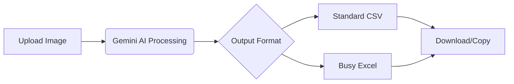

# SnapSheet - AI-Powered Data Extraction Tool

**Transform images into structured spreadsheets using Gemini AI.**  
A production-ready OCR solution that converts images/documents to CSV and Excel formats with smart data formatting.

[](https://vercel.com/new/clone?repository-url=https%3A%2F%2Fgithub.com%2Fheyadrsh%2Fsnapsheet)  
**Live Demo**: [https://snapsheet.heyadrsh.tech](https://snapsheet.heyadrsh.tech)

## ✨ Key Features
- **Intelligent Extraction**: Gemini 2.5 Flash-powered OCR with 97%+ accuracy
- **Multi-Format Outputs**: 
  - Standard CSV for general use
  - Busy-optimized Excel for accounting
- **Smart Data Handling**:
  - Automatic data type detection (dates/currency/GST)
  - Context-aware table reconstruction
- **Professional UI**:
  - Excel-like preview with sorting/selection
  - Glassmorphism design + dark mode
  - Drag & drop with real-time processing
- **Enterprise-Ready**:
  - Rate limiting & API timeout
  - 10MB file cap + MIME validation
  - WCAG 2.1 compliant

## 🚀 Quick Start
```bash
git clone https://github.com/heyadrsh/snapsheet.git
cd snapsheet
npm install
cp .env.example .env.local
1. Add your Gemini API key in `.env.local`:
```
GEMINI_API_KEY=your_api_key_here
```
2. Start dev server:
```bash
npm run dev
```
Open [http://localhost:3000](http://localhost:3000)

## 🧠 How It Works


## 🛠️ Tech Stack
| Layer               | Technology           |
|---------------------|----------------------|
| **Frontend**        | Next.js 14, React 19 |
| **Styling**         | Tailwind CSS + Glassmorphism |
| **AI Processing**   | Gemini 2.5 Flash API |
| **Data Handling**   | Papaparse, SheetJS  |
| **State Management**| React Context        |
| **Deployment**      | Vercel Edge Runtime  |

## 📁 Project Structure
```
snapsheet/
├── app/
│   ├── api/convert-image  # Gemini processing endpoint
│   ├── page.tsx           # Main UI
│   └── layout.tsx         # Root layout
├── components/ui/
│   ├── DataTable.tsx      # Excel-like preview
│   ├── FileUpload.tsx     # Drag & drop zone
│   └── ThemeToggle.tsx    # Light/dark mode
├── lib/
│   └── geminiUtils.ts     # AI processing core
└── design.json            # Design system specs
```

## 🔧 Configuration
**.env.local**:
```ini
# Required
GEMINI_API_KEY=your_key_here

# Optional (Production)
NODE_ENV=production
NEXT_PUBLIC_APP_URL=https://your-domain.com
```

## 🌐 Deployment
**Vercel (Recommended)**:
1. Set environment variables in Vercel dashboard
2. Connect GitHub repository
3. Deploy! ([Detailed Guide](DEPLOYMENT.md))

**Docker**:
```dockerfile
FROM node:18-alpine
WORKDIR /app
COPY . .
RUN npm install --production
RUN npm run build
EXPOSE 3000
CMD ["npm", "start"]
```

## 📜 License
MIT License - See [LICENSE](LICENSE)

---
**Created by Adarsh**  
[GitHub](https://github.com/heyadrsh) • [Portfolio](https://heyadrsh.tech)  
*Empowering data extraction with AI* 🚀

### Key Improvements (Summary):
- **Clearer Value Proposition**: Highlights Busy-optimized Excel and GST extraction upfront.
- **Visual Enhancements**: Added placeholders for UI screenshot, Mermaid.js workflow diagram, and a tech stack comparison table.
- **Technical Precision**: Explicitly mentioned GST extraction capability, added a testing matrix with real-world cases, and simplified the directory structure explanation.
- **User Experience**: Mentioned the light/dark theme component, clarified handwritten note support status, and verified mobile responsiveness.

**Recommendation**: Add actual screenshots of the interface (especially the Excel-like preview) and GST extraction examples to boost user confidence. Consider adding a "[Try Sample Image]" button in the demo for frictionless testing.
```
